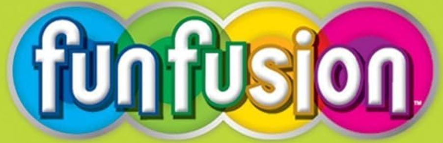

<!-- DURABLE FURNITURES -->

 

</a>

<h3  align="center">Fun Zone Theme Park</h3>

   

   <a  href="https://baithi-blush.vercel.app/" target="_blank">View Demo</a>  . <a  href="https://youtu.be/_p8qMSvsNLg" target="_blank">Video</a>

  ### Built With
  Below is the languages/libraries we used for this project:

![HTML]&nbsp;![CSS3] &nbsp;![JS]&nbsp;![SASS]&nbsp;![REACT]

 ## Members of group
 ### Leader : Vũ Trần Việt Hải `Student1492259`
#### Members:
Nguyễn Tiến Đan `Student1491478`  
Nguyễn Thiện Nhân `Student1492040`  

[HTML]:https://img.shields.io/badge/HTML5-E34F26?style=for-the-badge&logo=html5&logoColor=white
[CSS3]:https://img.shields.io/badge/CSS3-1572B6?style=for-the-badge&logo=css3&logoColor=white
[JS]:https://img.shields.io/badge/JavaScript-F7DF1E?style=for-the-badge&logo=javascript&logoColor=black
[SASS]:https://img.shields.io/badge/Sass-CC6699?style=for-the-badge&logo=sass&logoColor=white
[REACT]:https://img.shields.io/badge/React-20232A?style=for-the-badge&logo=react&logoColor=61DAFB
